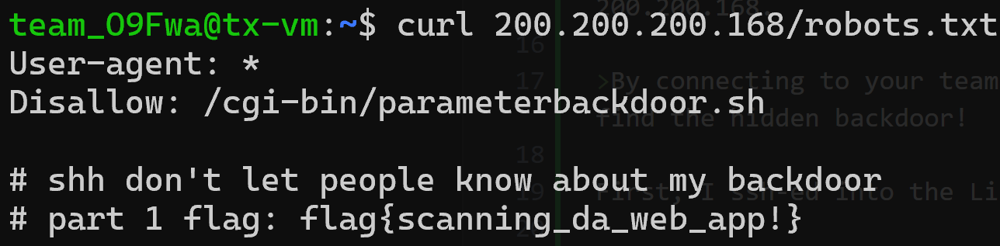

Challenge: Find The Flag

Category: National Cybersecurity Lab (NCL)

>⚠️ Every team has a unique instances used to access this challenge.

>⚠️ The details to connect to the challenge will be provided and pinned in your team's discord channel.

>This is a multi-part, penetration-testing-like challenge that builds upon multiple different skills that has been covered during the workshop.

>You will start by connecting to the provided linux machine.

>From this linux machine, you can then access the vulnerable machines and pivot through the network to find the flag.

>For the first part, there is an APACHE web server running at the following IP address: 200.200.200.168. 

>By connecting to your team's machine first, you can then access this web server and try to find the hidden backdoor!

First, I ssh-ed into the Linux machine.

Then since the challenge description said there was an `APACHE` web server running at `200.200.200.168`,

I decided to curl robots.txt for any clues..
```sh
curl 200.200.200.168/robots.txt
```



> flag{scanning_da_web_app!}

