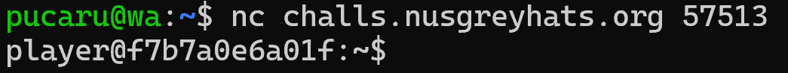
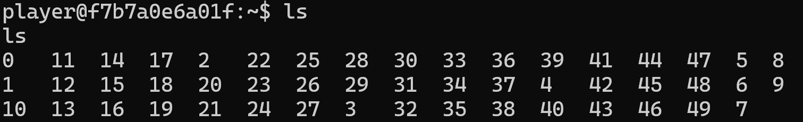
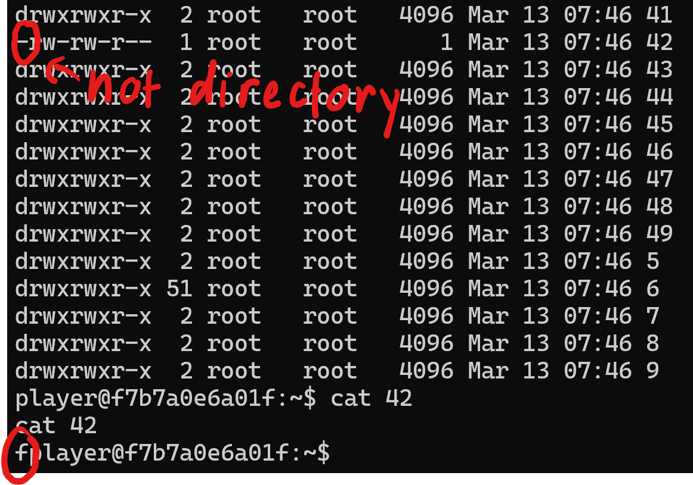
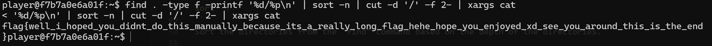

Challenge: Kage Bushin No Jutsu
Category: Linux

>This is a true conversation that happened between the challenge creator and his flag.

>Elma: "Hey I need a challenge for HackBash, can you find a way to hide yourself?"

>Flag: "ok! TAJU KAGE BUSHIN NO JUTSU"

>Elma: "WTF??? "

>Legend says, even the challenge creator can't find the real flag anymore...

>nc challs.nusgreyhats.org 57513
>nc challs2.nusgreyhats.org 57513

Upon "netcat"-ing, 



It starts a linux terminal. 

After running "ls" we are able to see 49 different directories.


Running "ls -la" we are able to see:
- (-l) All information of all files
- (-a) All hidden files (if any)



Then, I "cat" file 42 after finding out that it is file & found the letter "f".
After changing my directory to the one with the biggest size (6), 

I found out that the flag is a combination of the file contents.

Then, I ran
```sh
find . -type f -printf '%d/%p\n' | sort -n | cut -d '/' -f 2- | xargs cat
```

Break down of the bash command!
```sh
find . -type f -printf '%d/%p\n'
```
Find and print the directories to all the "file" type files.

```sh
sort -n
```
Sort the directories from the "find" command based on the depth of the directories.

```sh
cut -d '/' -f 2-
```
Remove the depth information and specify the delimeter to be "/". Then, keep the output from the second field.

```sh
xargs cat
```
Pass the output (of the file directories) into cat.

Now, here is the output!



>flag{well_i_hoped_you_didnt_do_this_manually_because_its_a_really_long_flag_hehe_hope_you_enjoyed_xd_see_you_around_this_is_the_end}