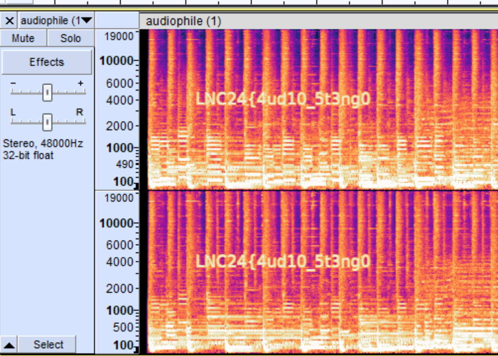

Challenge: Audiophile
Category: Forensics

> I love listening to music! did you know that while MP3 files are compressed and smaller, while WAV files are uncompressed and larger? Many people can't hear the difference but I certainly can!

I spent 100 points on this challenge!!!!! (no yay)

Hint1: theres something fishy in the first part of the audio
Hint2: some bits are less important than others

I had this thing where I HAD to buy hint1 to see hint2 so owell

First, I jammed it into audacity:



You can see the front part of the flag:
>LNC24{4ud10_5t3ng0

Then, I ran installed stegolsb wavsteg and ran:
```sh
stegolsb wavsteg -r -i audiophile.wav -o output.txt -n 2 -b 1000
```
and got the second half of the flag!!!!

>_15_fun}

Combined:
>LNC24{4ud10_5t3ng0_15_fun}

no yay.
