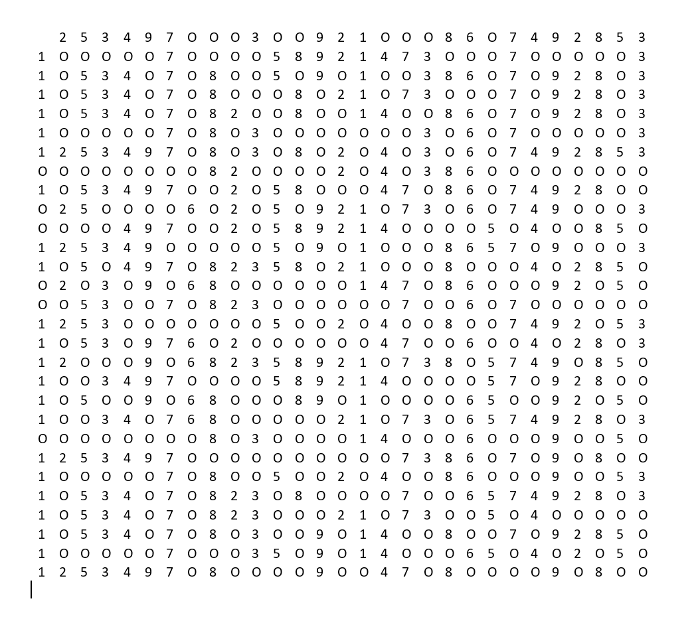
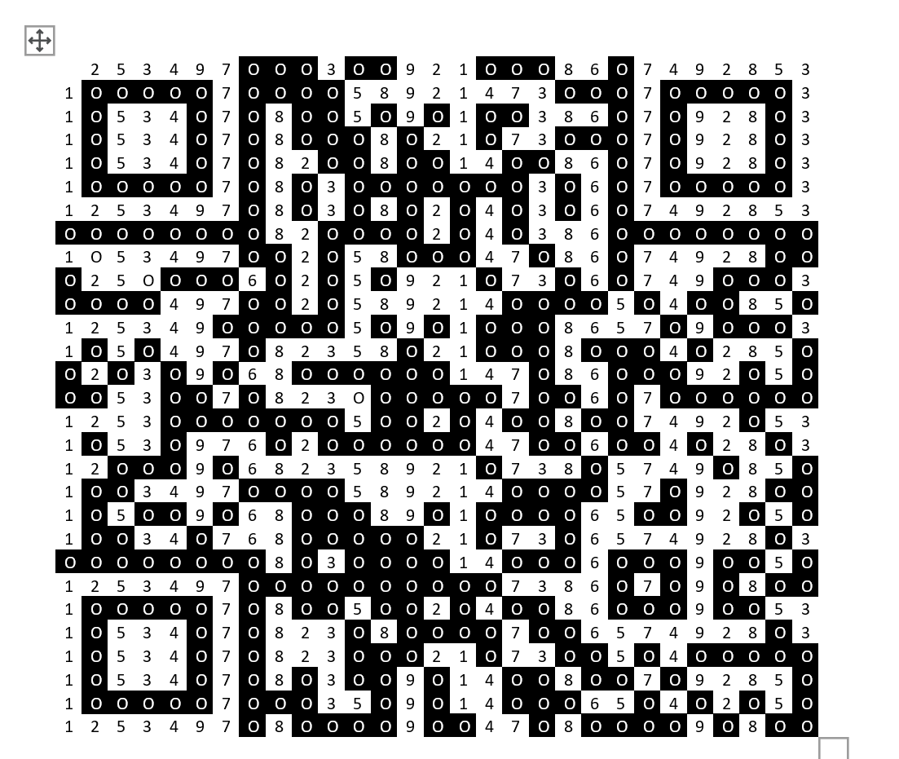

#GetItBack
## Category: FORENSICS

> Eval was working on his major assignment report to submit to his teacher when suddenly his computer shut down unexpectedly due to a power outage, and he hadn't saved the report even once.

> However, instead of starting a new report, Eval chose to spend 4 hours trying to recover the original report from the crash dump file, but ultimately failed. Eval really needs help.

This took `a lot` of research :D.

First, I installed volality. 

https://github.com/volatilityfoundation/volatility/wiki/Installation


Next, I followed a writeup https://ctftime.org/writeup/26339

```sh
pucaru@wa:~/volatility3$ python3 vol.py -f ../LNC24/GetItBack/MEMORY.DMP windows.filescan.FileScan | grep "Word"
```
Found:
`0x8a06722ade70  \Users\IEUser\AppData\Roaming\Microsoft\Word\AutoRecovery save of Document1.asd 216`

Then, 

```sh
python3 vol.py -f ../LNC24/GetItBack/MEMORY.DMP windows.dumpfiles --virtaddr=0x8a06722ade70
```

Then, we now have a .asd file.
Open it in word:


Originally, I thought that there was something sus with the picture.
Then, I had flashbacks of challenges with white text in the background, so I highlighted the entire document....


Upon saving and removing the Discord profile picture, 



I thought it was cipher text, but after ~ 10 minutes of no results, I had flashbacks to a challenge in CDDC where you had to trace your keyboard letter by letter to get a flag.

So I decided to randomly do something dumb:
Shade in the cells that contain the letter "O".
Then I found.............................


Flag:
> LNC24{r3c0v3r_h1dd3n_fr0m_m3m}

.............................................................................................
no comment