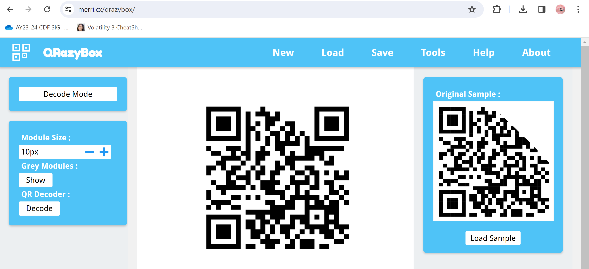

Challenge: The Elusive Red Herring
Category: Forensics

>In the depths of the ocean, fish in general, are hard to come by due to global warming. However, I just found a red herring, with a weird brusied QR code attached on its skin? I don't assume it could be of use to you?

At first, I thought that I needed to recover the QR code; so I did. Using 29x29 grid.

Upon scanning it, you get:

https://me-qr.com/text/4348008/show

Where you DONT GET YOUR FLAG.

Fake Flag:
> LNC24{red_herring}

Then I took the picture and slammed it into:

https://www.aperisolve.com/d5486faadfd6f2b0a412a275f3f499cc

I saw that the binwalk had multiple files. Then, I downloaded and opened the folder in 7ZIP.
Because there were 10,000 files, I just sorted by size and randomly found the real flag.txt in 6790!!!! (yay)

Flag:
> LNC24{d0nT_f4LL_4_r3d_h3rR1nG5!}

yay(yay)
