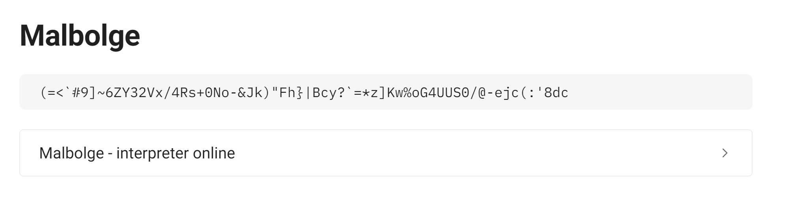
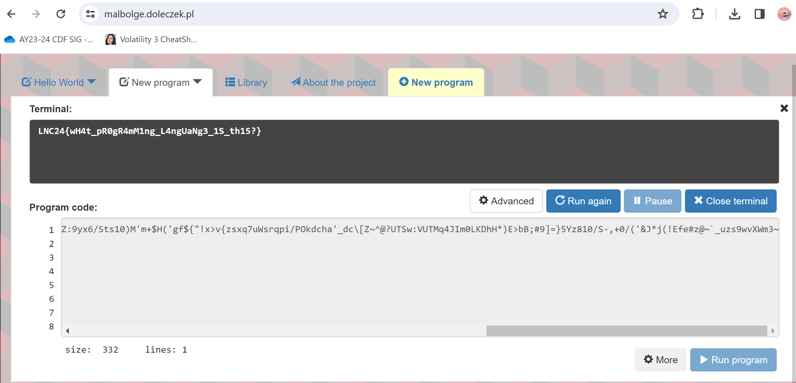

#Unknown Lingo
## Category: MISC

> Easy
> It seems like this particular message is encoded in another esoteric language

lingo.txt:
>D'`r_?o~IlY{EDCvR32saM(o]+kkY43f1{@?-a`<)sKwvuWVrk1ohmf,jchgfed]#D`_XW{[ZSXWVOsSR43OHl/.Dh+*FE>b%;@?8\}54321U54ts10)M',%*#('~D$#"!~}v^tsr8YXtmrk1onmlNMib(I_^cb[!_^W?[TSRWPt7SLQPIHlLKDCg*)E>bB$:?8=6Z:9yx6/Sts10)M'm+$H('gf${"!x>v{zsxq7uWsrqpi/POkdcha'_dc\[Z~^@?UTSw:VUTMq4JIm0LKDhH*)E>bB;#9]=}5Yz810/S-,+0/('&J*j(!Efe#z@~`_uzs9wvXWm3~

TBH I was confuzzled by this for awhile until I reread the prompt:
It seems like this particular message is encoded in another `esoteric` language.

Then I searched it up and found this webpage:
> https://0xss0rz.gitbook.io/0xss0rz/ctf/cryptography-1/esoteric-programming

lingo.txt looked like that "Malbodge" cipher text, so I just found a decoder and got the flag:

> LNC24{wH4t_pR0gR4mM1ng_L4ngUaNg3_1S_th15?}

yay

