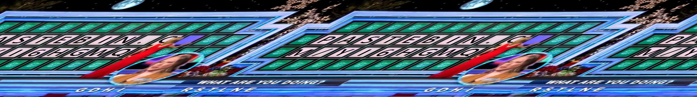

Challenge: Wheel Of Fortune
Category: Misc
Seems like there is a recurring theme of wheels.....

> Medium
> Who is the winner of Wheel of Fortune?
[WheelOfFortune.txt](./WheelOfFortune.txt)

PS: I do not think this is the most effective way of completing this challenge, but it is how I completed it! :)

I opened the file, googled `convert rgb codes to image online` and found this website:

Although it froze my laptop every time I changed the width, I highly recommend it 10/10

Now that I got this picture:

You tilt your neck at a horribly uncomfortable angle to read the text 👍

Unfortunately, we are only able to see 7/8 of the entire pastebin code.
As a non-avid watcher of Wheel Of Fortune, I had to Google what the letters at the bottom meant:

> "wheel of fortune format letters on left and right"

Then, I assumed that the letters below their faces meant that they guessed it & it is on the board.

From the above picture, you can tell that the letter is uncovered, so I began guessing..
> G,D,H and I

I also clicked another PasteBin's link and realised it is case-sensitive.
Through trial and error:
I found the PasteBin @ https://pastebin.com/Yi6hgwqh

Flag:
> LNC24{D0_n0t_4ll0w_th3m_p34c3_2687f2b41646cc94394c06208d2444df}

