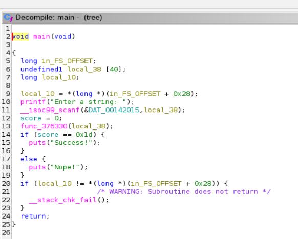
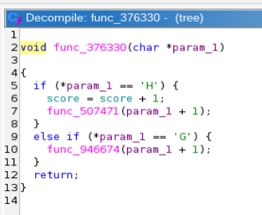
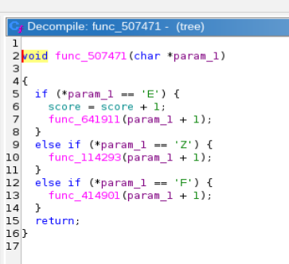

Challenge: Christmas Tree

Category: Forensics

I opened the "tree" file in Ghidra to try and reverse engineer the file. 

Open the main function 

After clicking into func_376330, 

I noted down the H (because of the flag format and the score + 1 statement)

Then clicked into func_507471 just to find out more about the program.

After following this pattern, we eventually find the full flag!

>Flag: HEX{s4nt4s_c0ntRoL_fL0W_tr33}