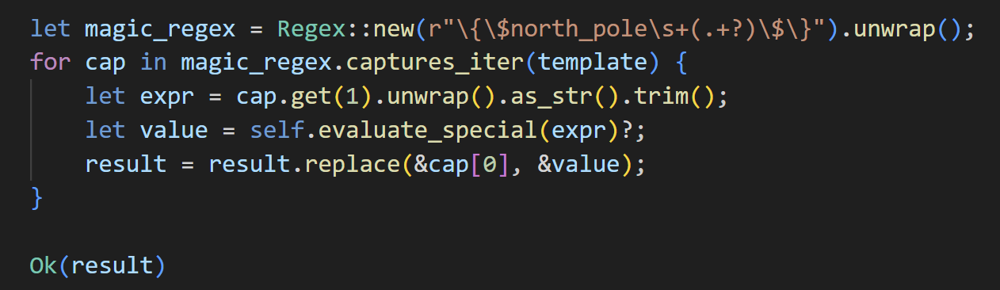
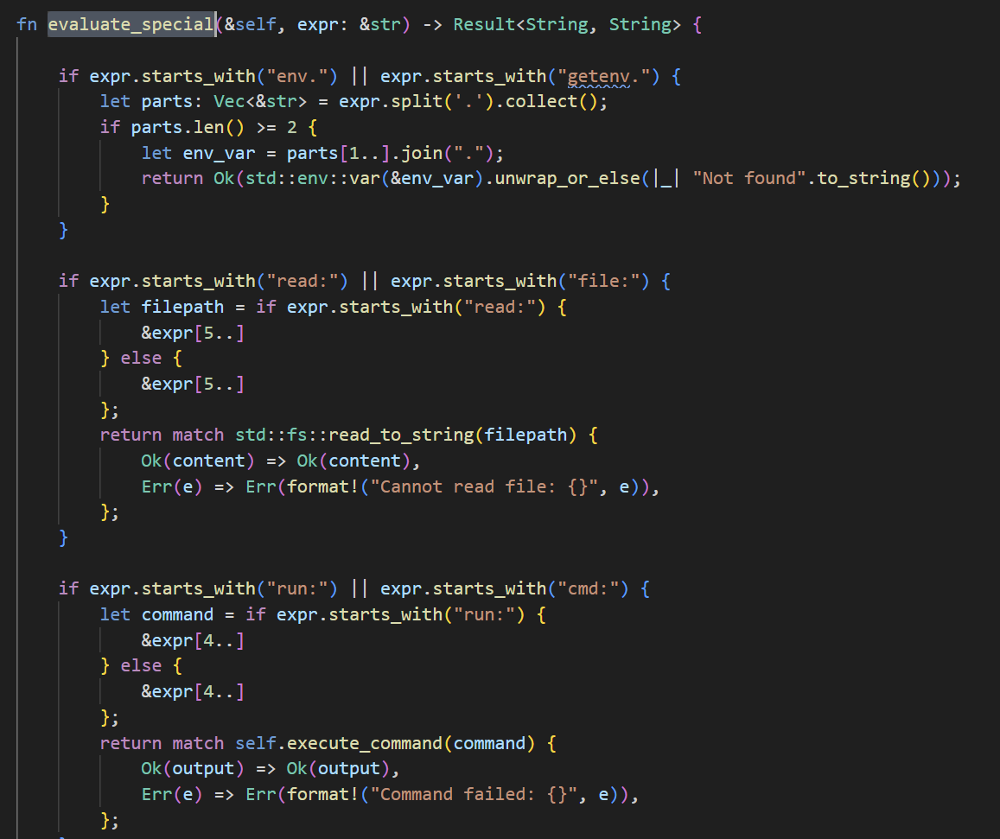
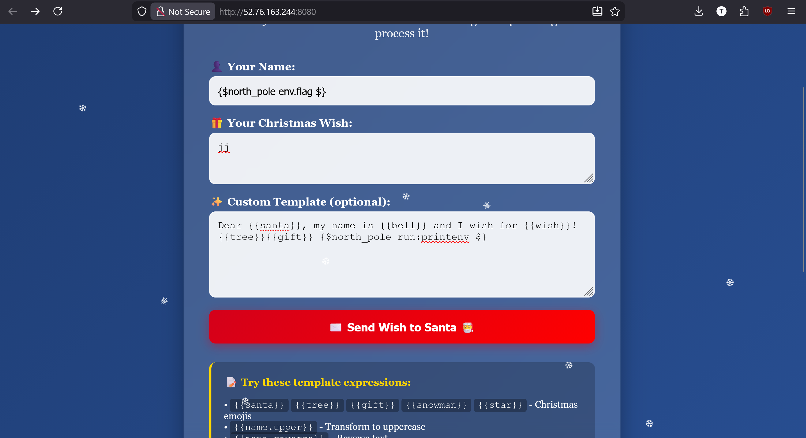
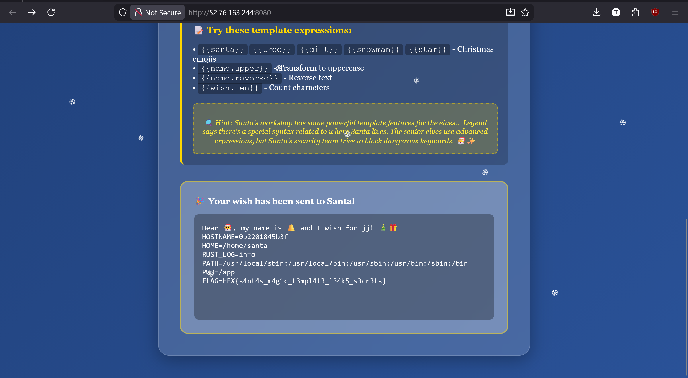

Challenge: Christmas Wishlist

Category: Web


From this code, it is said that evaluate_special will handle 
```sh
{$north_pole ... $}
```


From this, I just put
```sh
{$north_pole run:printenv $}
```
into the template and got the flag!



>Flag: 


