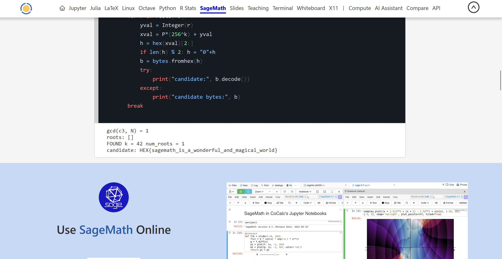

Challenge: Small and Simple Things 

Category: Crypto


```
N = 0x355ba80ed8f6ed0e3d73f1e8dd90085db632fa60f031cd5b07dafda16d8fc0787af9417481b7d52eb99b531d6d92e85be0bf2993e223c91e0a8676ae619847dba0f80e2777ebc7e90a6dfd6ef0ef5f88a035c1d5ef56c2da799f2c6fb300343dc9c61d64908e7321b250a113fcab8dc777804f31926dfddbfca1ad22b54a3e64fe164bc3b890409c495de3af192a3838521ba6be9e57c71f0e9dcd14cacb454f133b9fa5548a47799305b47f7d54bb678610cbe12fd7a0ef00e0f4918da6ed6b

c0 = 0x3e568d71880ec0b281944ee7bb02eb2fddd128291d072b0f0b1b7fc6967f7ca959985ea033bf847018776364d4ffdc4b6610d0070563d60086de78e0532fb94d3b370a968080b7f87ac9d175edf5ce455d92068a0965185a679c8c995ccd1b37b58fa6476c555e100d30310f8ef49e66a877747da4fd2cfc00f208741bafdf53b61392a1851af682099689b94a5ec163dd840d81377bbe0db3c6de16deeccd629c19511a90bcfa3c51c08fdc92e6b32a92d6b2291714416966512dffc1e9800a
c1 = 0x9aa3a3c39073307155aade05588c539e2079bcd0dae43092c4ae7479d3073c660f86840e6f4128a766673d2dfa36f7d79575207e1835a5f68ea1856dd5f4d6965b814ca04b962db8c10c13908722176f6658b1a772156ebc490c8bc8b71c5e490e1666613fda97b6c60dfa85b5a7c8c6a11cf3f37d9dbe9c18166067df22072ff64ca975092681906fc7ae328913648cdd8b6108d2608d58f45f7399b986a5a97266e6e81ed09ba6ce3f440fd3561d0ef7e1d758149f608acd7962308ebc416a
c2 = 0x4c357d8139d9951ea48796e145cfa7a09199020cfabf734aaab35a02e8d88cac062349c29790ae30a72ee951d801c392781e9845f2a5d0a8e3e830a026f53b24845b0d272cea249bdd1db72ef520ac5a363df374547e89425d351f394214b6514b4b9bee89279ffa9f1c9d34483be31ae48f6c2f36d4d7a554fe9984f5f7f056faa78dda25c4e848f23a06556d7d319e5e5d6db493ea09ce52ad5a27ac6f9a3b472e6d7e2f6380b1fb4f72cd4017f69114bd7c052b0ffc27de8af4f2dcecc8a6
c3 = 0x5f0cd34ee42c882d372cf1dab7e7049cb2f71a65d3be4c6107e45aaadf21be58e3e716b6fe9a42cb05e8ecd9574654539885bc95a57e2c9722231a04bb0a992d6c923a42cb9e9ea7ccca78ef6ef36b42d1208b15843c43a8793fffd2758a391383ec9272d43acd3dfa32bdb989298e2301b7092807f580882810a174329e6045f5374772fce05f0c73ea85e67b8a42bb0b541c59083d6c104c55d31d2d02cc2862b85d5a636fd11819827792a267fe2239abb332be2ea917dd448476fdd6835b

target = 0x34d45d13a2838e7e1835f747ca74355e4121f45347be4c4e589cb9e626c7be12fe10076d97c78441ed32dbd99fec99d68bb62348d947831ff324a0404c87f730aa2e8fe9c3259c84a10fabd721ae987e6821e24bc8ef079a904186ec8c6be5cbb6c8c83e5a348dc728717ff930c0eb9d4298b1b66a1cf6ffe253873cc19f859fe70af93c5395ba8779ffc8d38b3fba9253d19c0dcc876e88b1bf8aaf0c9ffa000c381a3f875690029a0bef9c9013ead80621158190a55b4cabfefc2bf0c20498

# --- Build polynomial mod N
R.<x> = PolynomialRing(Zmod(N))
f = (c0 + c1*x + c2*x^2 + c3*x^3 - target)

# --- Make it monic (required by small_roots)
g = gcd(Integer(c3), Integer(N))
print("gcd(c3, N) =", g)

if g != 1:
    print("Nice: leading coeff shares factor with N. Factor found:", g)
    # If this happens, you can factor N as g*(N//g) and solve by CRT / direct methods.
else:
    inv_c3 = inverse_mod(Integer(c3), Integer(N))
    f_monic = (inv_c3 * f)  # now leading term is 1*x^3
    # (Optional sanity) print(f_monic.leading_coefficient())

    X = 2^512
    roots = f_monic.small_roots(X=X, beta=0.5)
    print("roots:", roots)

    for r in roots:
        rr = Integer(r)
        h = hex(rr)[2:]
        if len(h) % 2:
            h = "0" + h
        b = bytes.fromhex(h)
        try:
            print("candidate (utf8):", b.decode())
        except:
            print("candidate (raw bytes):", b)
def b2i(b): 
    return Integer(int(b.hex(), 16))

prefix = b"HEX{"
P = b2i(prefix)

for k in range(4, 121):   # try unknown length 4..120 bytes
    R.<y> = PolynomialRing(Zmod(N))
    x_expr = P * (256^k) + y

    fy = (c0 + c1*x_expr + c2*x_expr^2 + c3*x_expr^3 - target)
    fy_monic = inverse_mod(Integer(c3), Integer(N)) * fy

    roots = fy_monic.small_roots(X=256^k, beta=0.5)
    if roots:
        print("FOUND k =", k, "num_roots =", len(roots))
        for r in roots[:3]:
            yval = Integer(r)
            xval = P*(256^k) + yval
            h = hex(xval)[2:]
            if len(h) % 2: h = "0"+h
            b = bytes.fromhex(h)
            try:
                print("candidate:", b.decode())
            except:
                print("candidate bytes:", b)
        break
```

> Flag:
