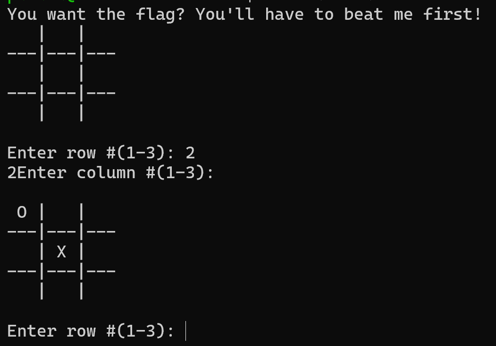
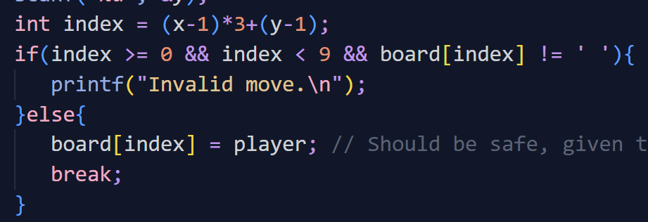
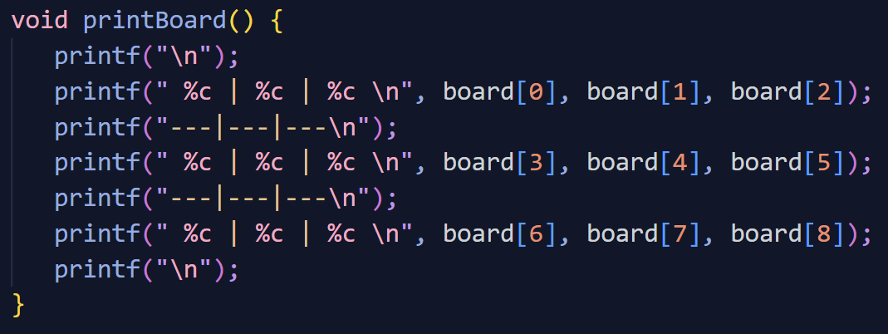
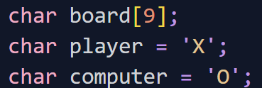
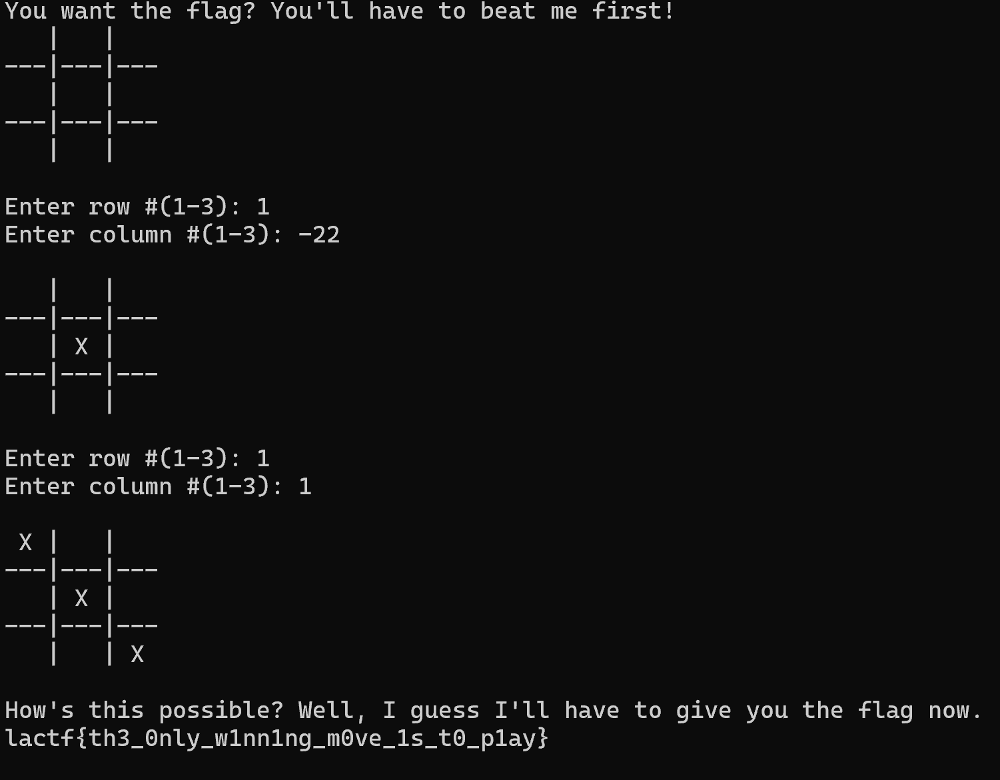

Challenge: tic-tac-no
Tic-tac-toe is a draw when played perfectly. Can you be more perfect than my perfect bot?
Category: Pwn
### This was done after the CTF!!
## Test

```
nc chall.lac.tf 30001
```
It is just a normal tic-tac-toe



## Infodump
chall.c was given to me:



For indexes < 0 & >= 9, it will run
```
board[index]  = player
```


Basically just adds X into the board by replacing board[index]

and since 

```
int index = (x-1)*3+(y-1);
```
index is controlled by user input, it is vulnerable.

TBH I got stuck here cus I had no idea what to do with that info. 

## Solution


```
gdb ./chall
```
So I used GDB to see where are the variables located in the program and whether it can be overwritten. 

```sh
(gdb) p &board
$1 = (<data variable, no debug info> *) 0x4068 <board>
(gdb) p &computer
$2 = (<data variable, no debug info> *) 0x4051 <computer>
(gdb)
```
0x4068 - 0x4051 = 0x0017 = 23 bytes


So the ``computer`` variable can be accessed via board[-23].

Because the code runs:
```
board[index] = player;
```
This overrides the ``computer`` variable with 'X'. After this, the computer puts X on the board. Since the player is also X, winner == player is now true!


> Flag: lactf{th3_0nly_w1nn1ng_m0ve_1s_t0_p1ay}